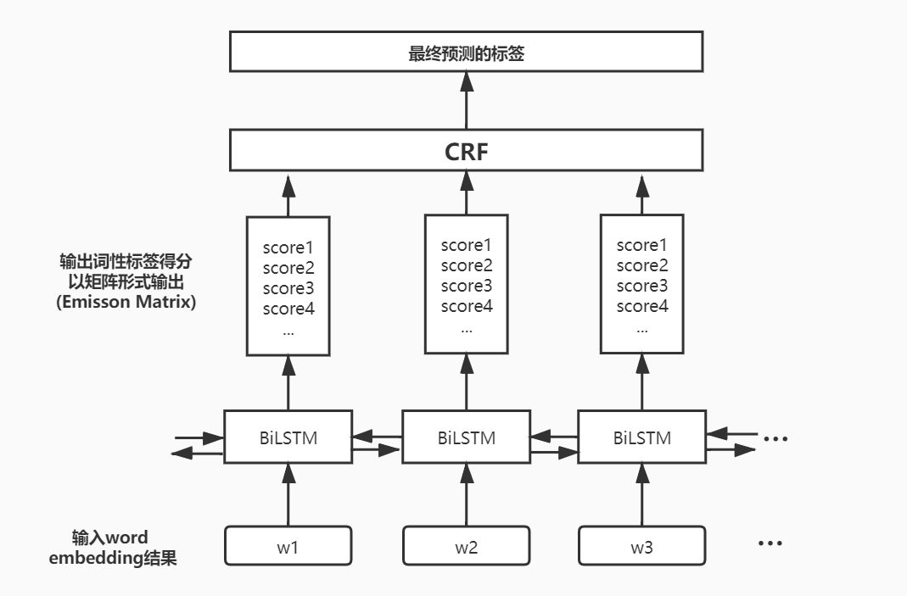
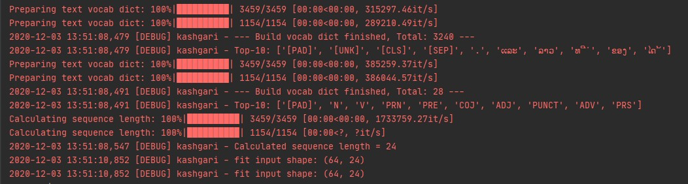
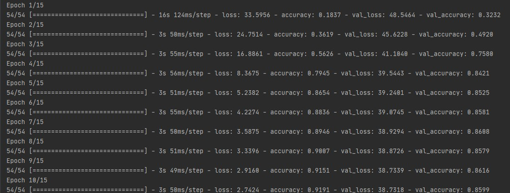
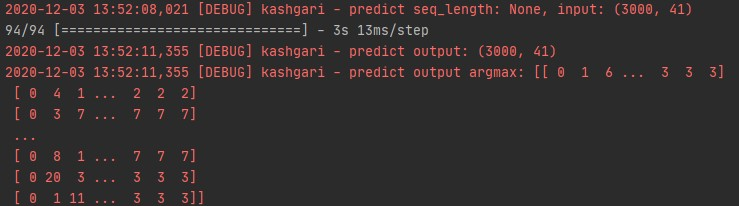

# 算法说明
#### 队伍：DUFLER  
#### [完整代码的github地址](https://github.com/FoVNull/SeqLabeling)
### 采用模型
> BiLSTM_CRF  (依赖 [kashigari](https://github.com/BrikerMan/Kashgari) 框架完成)  
> 主要层次分为  
>- BiLSTM(双向长短时记忆网络)层 
>- CRF(条件随机场)层  
>
> 总体过程 (与常规的BiLSTM_CRF一致):  
>
#### BiLSTM
> 利用BiLSTM进行标签的预测，简要过程如下
>1. 输入word embedding的结果, 
>使用的方法是基于tf.keras.layers.Embedding的预训练Word2Vec/GloVe词嵌入方法  
>2. 输出Emission matrix, 结构为 
>```
>List[
>    List[I1-L1, I2-L1...],
>    List[I1-L2, I2-L2...],
>    ...
>]
>```
>> I1-L1 意为 第1个词为第1个标签的得分，List[0].length = tag_size(标签的种类数)  
>
> 部分参数: layer_units=128, batch_size=64, epochs=15
#### CRF  
> 对预测结果进行约束，保证预测结果的合理性，简要过程如下  
> 1. 将BiLSTM层输出的Emission matrix输入
> 2. 由于kashgari是基于tensorflow实现的CRF, 所以通过crg_layer自动生成Transition matrix(转移矩阵)  
> 转移矩阵维度为tag_size*tag_size, 矩阵中的元素Xij, 指代label-i 转移至 label-j的概率
> 3. 根据CRF损失函数构建图，顶点为(word_index, label),   
> 顶点的权值为Emission Score+Transition score(两个矩阵中对应点的值之和),  
> 边的权值为转移概率，寻找出权重最大的路径，即为最优解，选取个顶点中的标签作为最终的预测结果。  
> 
### 数据预处理
> 进行了简单的预处理，见项目的preprocess部分。未引入外部语料
>
### 训练、测试中的截图
> 部分运行截图  
>
>
>
>
>
